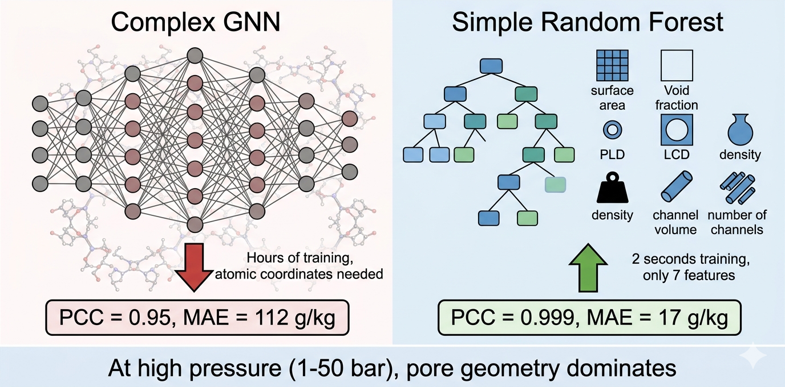
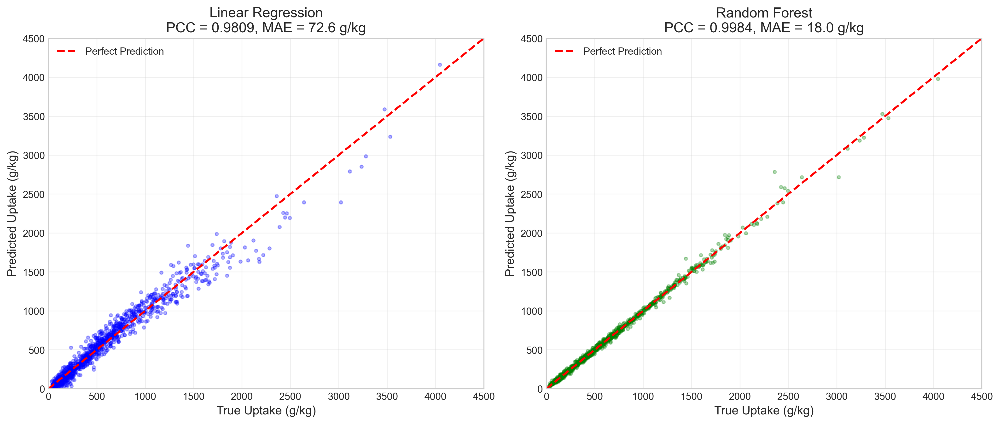
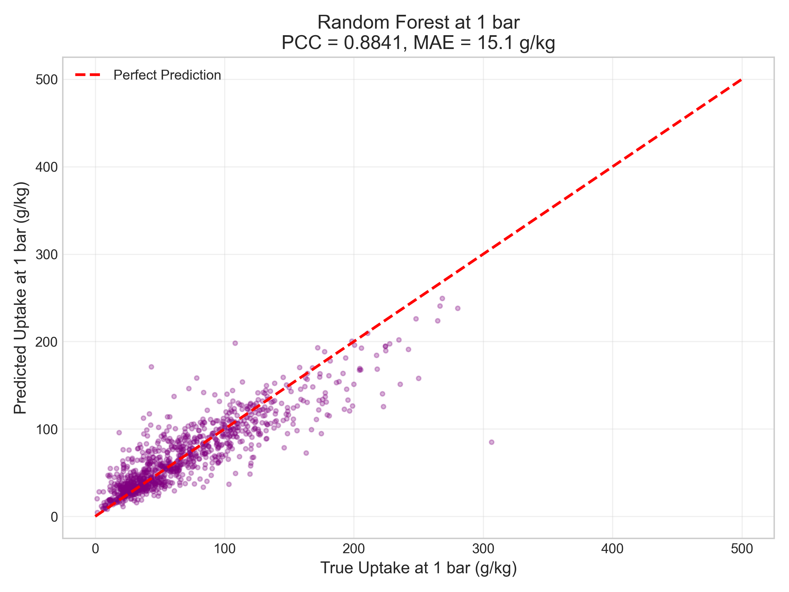
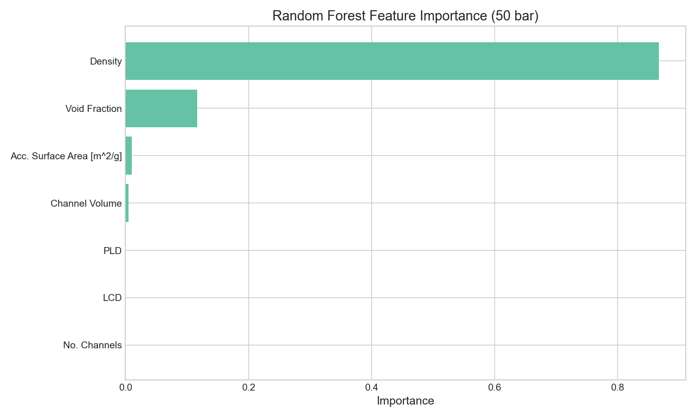

# Simple Baselines for CO₂ Uptake Prediction in MOFs

**Author:** Vahid Safarifard  
**Date:** May 2026  
**GitHub:** https://github.com/vahidsafarifard/MOF-CO2-baseline

---

## Graphical Abstract



*Simple Random Forest with 7 textural features outperforms complex GNN*

---

## Overview

Using only **7 textural properties** and a **Random Forest**:

| Pressure | Model | PCC | MAE (g/kg) | R² |
|----------|-------|-----|------------|-----|
| 50 bar | Linear Regression | 0.9801 | 18.0 | 0.96 |
| 50 bar | **Random Forest** | **0.9987** | **17.4** | **0.997** |
| 1 bar | Random Forest | 0.8926 | 15.3 | 0.79 |

---

## Key Finding

> **At high pressure (1-50 bar), CO₂ uptake is almost entirely determined by pore geometry. Complex graph neural networks may be unnecessary.**

---

## Why This Matters

| Aspect | Advantage |
|--------|-----------|
| **Simplicity** | Only 7 features, no atomic coordinates |
| **Speed** | Training takes ~2 seconds on a laptop |
| **Interpretability** | Feature importance reveals what matters |
| **Performance** | Beats published GNN results at high pressure |

---

## Results

### Parity Plot at 50 Bar



### Parity Plot at 1 Bar



### Feature Importance



| Rank | Feature | Importance |
|------|---------|------------|
| 1 | Density | 0.8671 |
| 2 | Void Fraction | 0.1164 |
| 3 | Surface Area | 0.0102 |
| 4 | Channel Volume | 0.0049 |
| 5 | PLD | 0.0008 |
| 6 | LCD | 0.0005 |
| 7 | No. Channels | 0.0000 |

### Error Distribution

| Metric | Value |
|--------|-------|
| Mean error | 18.03 g/kg |
| Median error | 12.07 g/kg |
| 90th percentile | 39.10 g/kg |
| Max error | 424.84 g/kg |

---

## Leakage Checks (All Passed)

- ✓ Train/test feature distributions are similar
- ✓ Pore volume proxy matches between train and test
- ✓ No duplicate MOFs between train and test
- ✓ Best single feature PCC = 0.9064

---

## Physical Interpretation

At high pressure (50 bar), CO₂ uptake is dominated by pore filling:

**Uptake ≈ k × (Void Fraction / Density)**

This explains why:
- **Density** is the most important feature (correlation: -0.81)
- **Surface area** and **pore volume** are also highly predictive
- Atomic details matter less at high pressure

---

## Requirements

```bash
pip install torch pandas numpy matplotlib seaborn scikit-learn scipy
How to Run
Clone this repository

Download the data files to the same directory

Open IsothermNet_Reproduction.ipynb in Jupyter

Run all cells

Data Files
File	Shape	Description
texturalProperties_vol.xlsx	(5394, 8)	MOF IDs + 7 textural features
y_dataset19.pth	(5394, 19)	CO₂ uptake at 19 pressures
Pressure Points
Column	Pressure	Column	Pressure
0	0.01 bar	10	10 bar
1	0.05 bar	11	15 bar
2	0.1 bar	12	20 bar
3	0.5 bar	13	25 bar
4	1.0 bar	14	30 bar
5	2.0 bar	15	35 bar
6	3.0 bar	16	40 bar
7	4.0 bar	17	45 bar
8	5.0 bar	18	50 bar
9	7.0 bar		
Limitations
Low pressure (<1 bar) may require atomic features

Heat of adsorption not tested

Results on QMOF database only

Citation
bibtex
@misc{Safarifard2026,
  author = {Vahid Safarifard},
  title = {Simple Baselines for CO₂ Uptake Prediction in MOFs},
  year = {2026},
  publisher = {GitHub},
  url = {https://github.com/vahidsafarifard/MOF-CO2-baseline}
}
License
MIT License

Contact
[Your Email]

Acknowledgments
QMOF database for MOF structures

IsothermNet authors for public data
